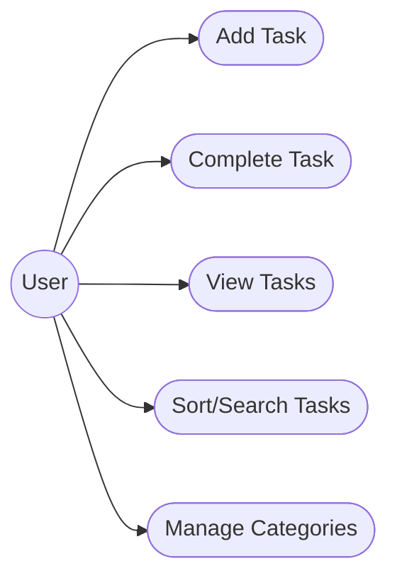
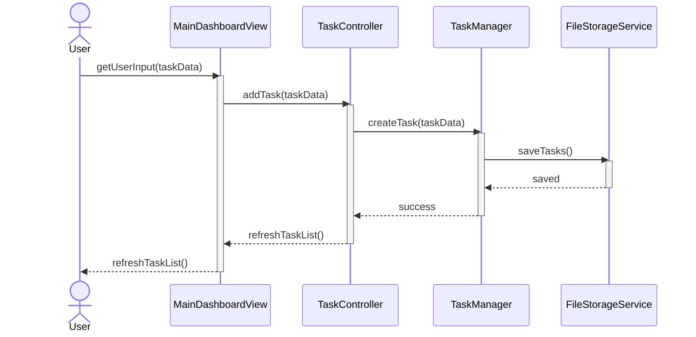
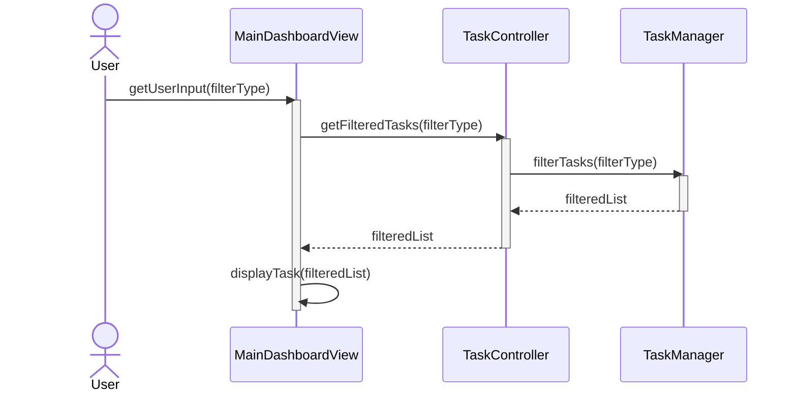
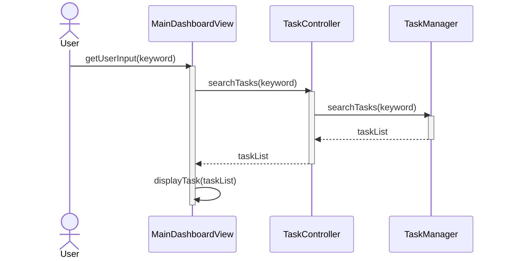
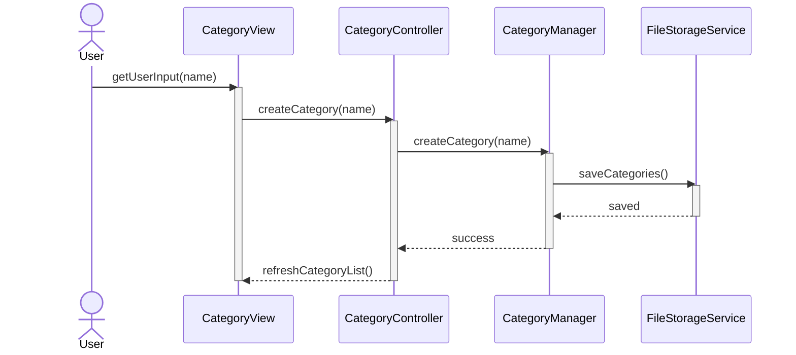
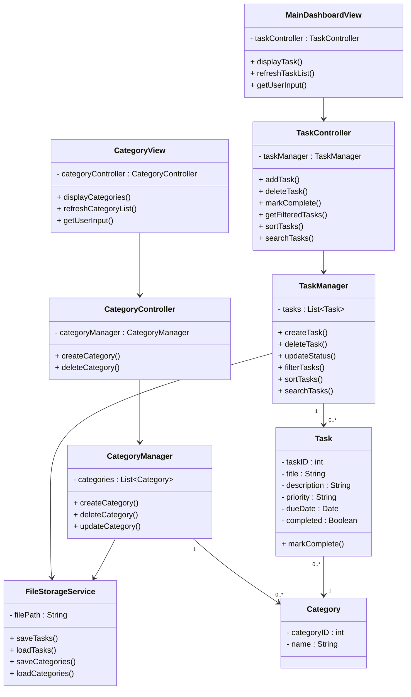
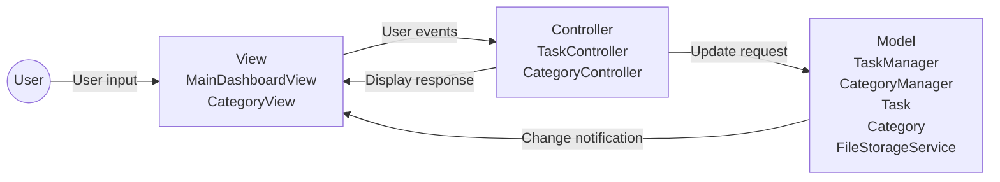

# 3354-Team1
**Team 1 – To Do App**

---

## Assumptions

- The system will support a single user interacting with the application.
- To-do list tasks will be stored on the user’s device locally using file-based storage.
- The system will manage around **100 to-do list tasks** without any noticeable decrease in performance.
- Categories for to-do list tasks can contain multiple tasks, while tasks can only belong to **one category**.
- The system will automatically load all saved tasks when the application starts.

---

# Software Process Model Used

The software process model employed for this project is the **Incremental Development Model**.

The incremental development model allows the system to be developed in small functional components called **increments**, with each increment adding features to the system until the final application is complete.

This model was chosen because it is well suited for a **to-do list application**, where functionality can be naturally divided into small components that can be implemented independently.

Advantages of this approach include:

- Development can proceed in **small, manageable segments**.
- Each increment adds **working functionality** to the system.
- It allows for **better timeline management**.
- It provides a **structured approach** to gradually building the full application.

---

# Software Requirements

## Functional Requirements

- The system shall allow the user to **create a new task** by entering:
  - Title
  - Description
  - Priority
  - Due date

- The system shall allow the user to **mark an existing task as completed**.

- The system shall allow the user to **view tasks and filter them by status**.

- The system shall allow the user to:
  - Sort tasks by attributes such as **due date or priority**
  - **Search tasks using keywords**

- The system shall allow the user to:
  - **Create task categories**
  - **Edit task categories**
  - **Delete task categories**
  - **Assign tasks to categories**

---

## Non-Functional Requirements

### Usability Requirement
- The system shall allow a new user to understand and perform basic task operations (**add, edit, delete, and complete tasks**) within **10 minutes** of initial use without formal training.

### Performance Requirement
- The system shall display the **task list within 2 seconds** of a user request.

### Space Requirement
- The system shall require **no more than 100 MB of disk space** for application installation and local storage of task data.

### Efficiency Requirement
- Task operations such as **sorting, filtering, and searching** shall complete within **2 seconds** when managing up to **100 stored tasks**.

### Dependability Requirement
- The system shall **correctly save all tasks without data loss** during normal shutdown.

### Security Requirement
- The system shall ensure that **task data stored locally cannot be modified or accessed by unauthorized applications during normal execution**.

### Environmental Requirement
- The system shall operate on **standard desktop operating systems**, including:
  - Windows
  - macOS
  - Linux  
  with **Java installed**.

### Operational Requirement
- The system shall support **basic mouse and keyboard interactions** for all user interface operations.

### Development Requirement
- The system shall be developed using **object-oriented programming principles**.

### Regulatory Requirement
- The system shall follow the **software engineering guidelines and requirements specified in the CS 3354 course project specifications**.

### Ethical Requirement
- The system shall **not collect or store personally identifiable information** beyond user-entered task descriptions.

### Legislative Requirement
- The system shall **store all task data locally** and shall **not transmit user data to external systems**.

### Accounting Requirement
- The system shall maintain **accurate records of task completion status** for tracking completed and pending tasks.

### Safety/Security Requirement
- The system shall **prevent loss or corruption of task data during unexpected application termination or system crashes**.

### Use Case Diagram

### Sequence Diagrams
- Add Task

- Complete Task

- View Task

- Sort/Search Tasks

- Manage Categories

### Class Diagram

### Architectural Design

